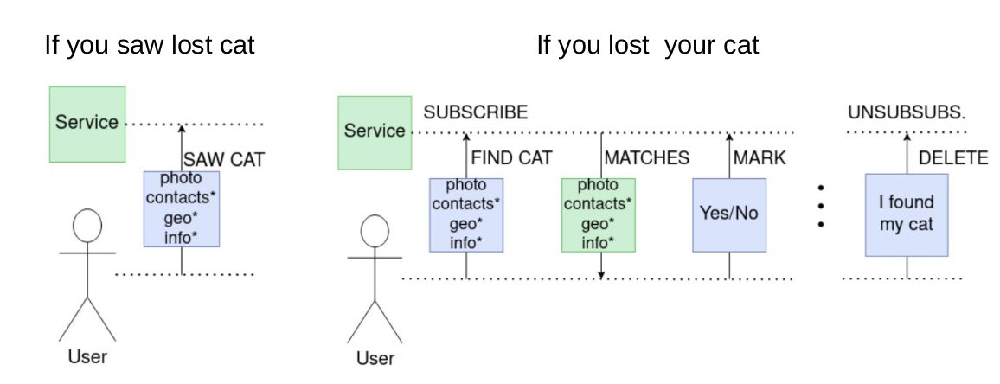
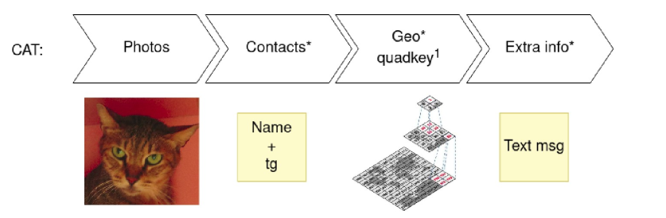
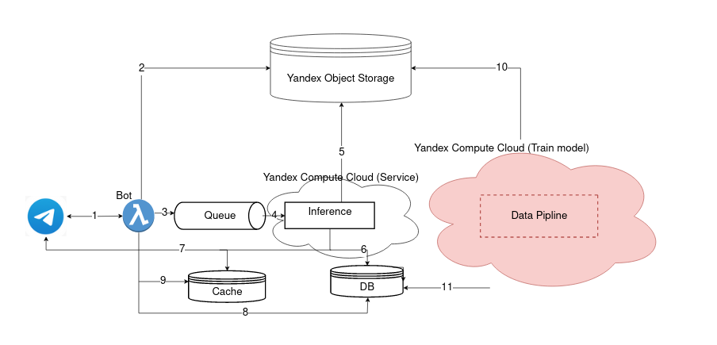
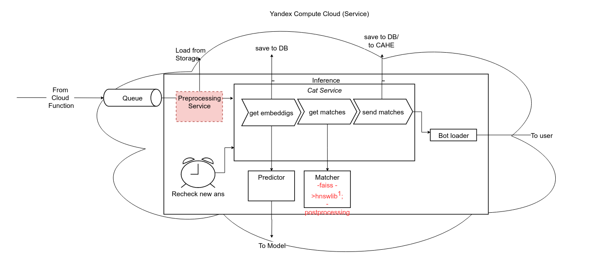

Recatizer
---
Lost pet search service. The project is frozen.
 
Scenarios
---
Use cases:

 

For each use case you have to upload information about the lost cat 
(for each use case):

Stack and system design
---

**Stack**: 
- Kafka, 
-  MongoDB, 
-  Redis, 
-  Yandex Cloud:
   - Yandex Object Storage (S3 type storage), 
   - Yandex Cloud Function (Serverless Function), 
   - Yandex Compute Cloud (VM),
- aiogramm.

**Inference:**

